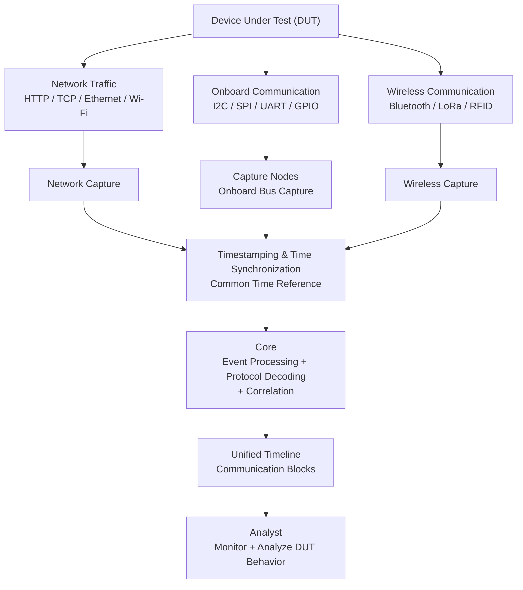
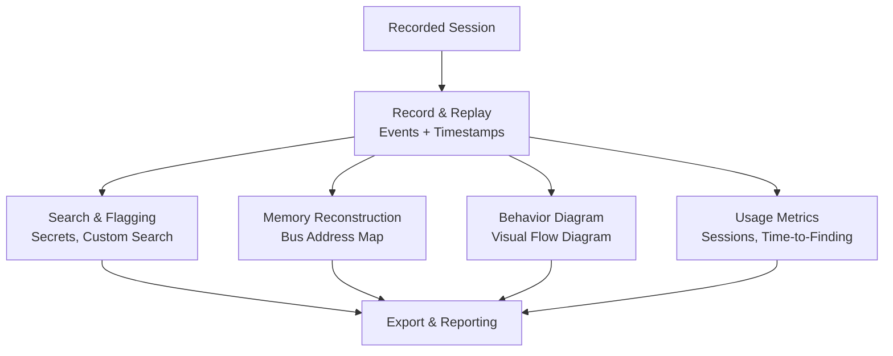
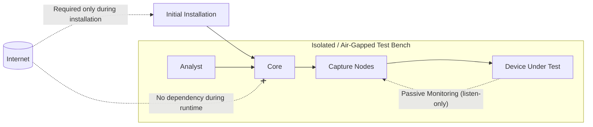
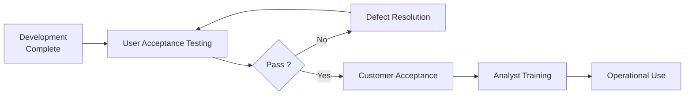

# Business Requirements → Functional Requirements

## BR-MON — Monitoring

**Source BR:** BR-MON-01 to BR-MON-08,
**Assignee:** BK,
**Status:** Completed.

### Summary
The monitoring module provides a unified live view of DUT communications across network, onboard-bus, and wireless interfaces, processing and correlating captured events on a synchronized timeline.

### Monitoring System Data Flow

### Functional Requirements

| FR ID | Requirement | Priority | Acceptance Criteria |
|---|---|---|---|
| FR-MON-01-1 | The system shall display network communication events. | Must | Network events are visible in the monitoring interface. |
| FR-MON-01-2 | The system shall display onboard-bus communication events. | Must | Supported onboard-bus events are visible in the monitoring interface. |
| FR-MON-01-3 | The system shall display wireless communication events. | Must | Supported wireless events are visible in the monitoring interface. |
| FR-MON-01-4 | The system shall provide a unified live view of captured communications. | Must | Events from supported sources appear in one live interface. |
| FR-MON-02-1 | The system shall correlate related communication events. | Must | Related events are grouped or linked correctly. |
| FR-MON-02-2 | The system shall order correlated events chronologically. | Must | Events appear in correct time order on the timeline. |
| FR-MON-03-1 | The system shall display live events within a documented latency limit. | Should | Measured event-to-display latency is documented and validated. |
| FR-MON-04-1 | The system shall synchronize Capture Nodes to a common time reference. | Must | All Capture Nodes use the configured common time reference. |
| FR-MON-04-2 | The system shall synchronize the Core to the common time reference. | Must | The Core uses the configured common time reference. |
| FR-MON-04-3 | The system shall document the maximum clock drift between monitoring components. | Must | Maximum observed clock drift is measured and documented. |
| FR-MON-05-1 | The system shall document the maximum supported number of simultaneous Capture Nodes. | Should | Maximum supported Capture Nodes are identified through testing. |
| FR-MON-05-2 | The system shall document the maximum supported number of simultaneous protocols. | Should | Maximum supported simultaneous protocols are identified through testing. |
| FR-MON-06-1 | The system shall support triggering a Snapshot Node based on a defined trigger event or signal. | Should | A configured trigger event or signal activates the Snapshot Node. |
| FR-MON-06-2 | The system shall support triggering a Snapshot Node after a defined delay. | Should | The Snapshot Node is triggered after the configured delay. |
| FR-MON-06-3 | The system shall support triggering a Snapshot Node based on a detected packet or pattern. | Should | Detection of a configured packet or pattern activates the Snapshot Node. |
| FR-MON-06-4 | The system shall capture the configured DUT state when a Snapshot Node is triggered. | Should | The configured physical, electrical, or internal state is captured. |
| FR-MON-07-1 | The system shall timestamp Snapshot Node outputs. | Should | Each snapshot output contains a timestamp. |

### Assumptions & Dependencies
- Capture Nodes and the Core can synchronize to a common local time reference.
- Required hardware for supported network, onboard-bus, wireless, and snapshot monitoring is available.
- Snapshot capabilities depend on the type of Snapshot Node being used.
- Maximum supported nodes, protocols, latency, and clock drift require validation on the final hardware configuration.
- The first version supports monitoring one DUT per session.

### Open Questions

- What is the target maximum latency for live event display?
- What is the acceptable maximum clock drift?
- Will NTP or PTP be used for time synchronization?
- Which Snapshot Node types will be supported in the first release?
- Which snapshot analysis capabilities will be available in the first release?

---

## BR-ANA — Analytics

**Source BR:** BR-ANA-01 to BR-ANA-08
**Assignee:** HK
**Status:** Completed

### Summary
The analytics module lets analysts search recorded sessions for sensitive data, generate report-ready diagrams and exports, automatically flag clear-text secrets, reconstruct device memory from bus captures, and track usage/ROI metrics.

### Analytics Module Data Flow

### Functional Requirements

#### FR-ANA-01 — Session Recording & Replay

| FR ID | Requirement | Priority | Acceptance Criteria |
|---|---|---|---|
| FR-ANA-01-1 | The system shall record all captured communication events from an active session, beginning when the analyst starts the session and ending when they stop it. | Must | Starting a session begins capture; all events from active Capture Nodes are present in the saved session. |
| FR-ANA-01-2 | The system shall record a timestamp for each captured event. | Must | Each recorded event has an associated timestamp. |
| FR-ANA-01-3 | The system shall persist a session to storage when the analyst stops it. | Must | A stopped session remains available after the application restarts. |
| FR-ANA-01-4 | The system shall allow an analyst to play back a previously recorded session. | Must | A stored session can be reloaded and played back. |
| FR-ANA-01-5 | The system shall preserve the original chronological order and timestamps of recorded events during replay. | Must | Replayed events appear in their original order and display their original capture timestamps, not replay time. |

---

#### FR-ANA-02 — Search & Navigation

| FR ID | Requirement | Priority | Acceptance Criteria |
|---|---|---|---|
| FR-ANA-02-1 | The system shall allow an analyst to search a recorded session using a custom search phrase. | Must | An analyst-entered search phrase returns matching results from the recorded session. |
| FR-ANA-02-2 | The system shall display the exact location (packet/timestamp/protocol) of each search match. | Must | Each result links back to its precise position on the timeline. |
| FR-ANA-02-3 | The system shall allow an analyst to navigate directly from a search result to its corresponding timeline event. | Must | Selecting a result jumps the view to that event on the timeline. |

---

#### FR-ANA-03 — Behavior Diagram Generation

| FR ID | Requirement | Priority | Acceptance Criteria |
|---|---|---|---|
| FR-ANA-03-1 | The system shall generate a Mermaid-based visual behavior diagram (e.g., a sequence diagram) from a recorded session's captured events, so analysts can understand a device's communication flow at a glance instead of manually reading the raw timeline, and so the diagram can be dropped directly into a client report. | Should | A Mermaid diagram is produced that reflects the session's captured events and renders correctly in a standard Mermaid viewer. |
| FR-ANA-03-2 | The system shall represent correlated communication events as linked steps within the diagram (e.g., in a sequence diagram, a login attempt's HTTP request and the I2C read it triggers on the DUT appear as connected messages between the same pair of lifelines), so analysts can easily see how events are connected without checking the raw session. | Should | For a known correlated event pair in the test session, both events appear in the diagram as visually linked/connected elements rather than disconnected entries. |

---

#### FR-ANA-04 — Export & Reporting

| FR ID | Requirement | Priority | Acceptance Criteria |
|---|---|---|---|
| FR-ANA-04-1 | The system shall allow an analyst to export recorded session data (e.g., as JSON or CSV). | Should | An export file containing session data is produced. |
| FR-ANA-04-2 | The system shall allow an analyst to export detected sensitive-data findings (e.g., as JSON or CSV). | Should | An export file containing findings (e.g., flagged secrets) is produced. |
| FR-ANA-04-3 | The system shall allow an analyst to export custom search results (e.g., as JSON or CSV). | Should | An export file containing the custom search results (each with its matched location, timestamp, and protocol) is produced. |
| FR-ANA-04-4 | The system shall export the generated diagram (e.g., a Mermaid sequence diagram of the session) in a report-ready format (e.g., PNG/SVG). | Should | The exported diagram opens correctly in a standard image viewer and matches what was rendered in-app. |
| FR-ANA-04-5 | The system shall allow an analyst to export the reconstructed memory map (e.g., binary/hex dump). | Should | The memory map can be exported and opened externally. |
| FR-ANA-04-6 | The system shall allow an analyst to choose which of the following to include in a single consolidated report: recorded session data, detected sensitive-data findings , custom search results , and the generated diagram  — exported in one or more report-ready formats (e.g., PDF, DOCX). | Should | The analyst can select any combination of session data, findings, custom search results, and generated diagrams, and the exported file, in a supported report-ready format, contains only the selected items. |

---

#### FR-ANA-05 — Sensitive-Data Flagging

| FR ID | Requirement | Priority | Acceptance Criteria |
|---|---|---|---|
| FR-ANA-05-1 | The system shall inspect captured packets for predefined clear-text sensitive data patterns and automatically flag matching packets, without analyst action. | Should | Plaintext credentials/tokens are automatically detected and flagged without analyst action. |
| FR-ANA-05-2 | The system shall provide a "Findings" control that toggles a contextual highlight mode on the timeline, emphasizing communication blocks containing flagged findings and fading unrelated blocks when active. | Should | Clicking the "Findings" control switches the timeline into highlight mode (flagged blocks emphasized, others faded, no separate view); clicking again returns to the normal view. |

---

#### FR-ANA-06 — Usage Metrics

| FR ID | Requirement | Priority | Acceptance Criteria |
|---|---|---|---|
| FR-ANA-06-1 | The system shall display a running timer showing elapsed time for the current active session. | Should | While a session is active, an elapsed-time timer is visible and updates continuously. |
| FR-ANA-06-2 | The system shall track the number of completed analysis sessions. | Should | A running count of completed sessions is tracked. |
| FR-ANA-06-3 | The system shall calculate the average time required to identify findings. | Should | An average time-to-finding value is computed and available. |
| FR-ANA-06-4 | The system shall track the number of automatically detected sensitive-data findings. | Should | A running count of auto-detected findings is tracked. |
| FR-ANA-06-5 | The system shall present the tracked usage metrics (e.g., session count, average time, average session time, findings detected) in a dashboard, filterable by a selectable time period. | Should | A dashboard shows session count, average time-to-finding, average session time, and findings detected, and supports date-range filtering. |

---

#### FR-ANA-07 — Memory Reconstruction

| FR ID | Requirement | Priority | Acceptance Criteria |
|---|---|---|---|
| FR-ANA-07-1 | The system shall extract address/data pairs from captured (e.g., SPI/I2C) bus transactions. | Should | Address/data pairs are correctly parsed from bus capture data. |
| FR-ANA-07-2 | The system shall aggregate extracted address/data pairs into a unified reconstructed memory map. | Should | A reconstructed memory map is generated from a session with bus captures. |
| FR-ANA-07-3 | The system shall allow an analyst to view the reconstructed memory map. | Should | The memory map is viewable within the application. |

---

#### FR-ANA-08 — Reconstruction Completeness

| FR ID | Requirement | Priority | Acceptance Criteria |
|---|---|---|---|
| FR-ANA-08-1 | The system shall classify each observed memory address range as fully observed, partially observed, or never captured. | Should | Every address range in the reconstructed memory map is correctly classified into one of the three states. |
| FR-ANA-08-2 | The system shall visually distinguish fully observed, partially observed, and never-captured ranges in the memory map. | Should | The three states are visually distinct in the reconstructed map. |
| FR-ANA-08-3 | The system shall display a completeness summary statistic (e.g., % of address space fully observed) alongside the memory map. | Should | A summary percentage is shown with the map. |

---

### Assumptions & Dependencies
- Accurate search/flagging depends on reliable timestamps from time sync (FR-MON-04).
- Session storage/format depends on BR-DEP export-import design (FR-DEP-02-x).
- At-rest protection of exported findings depends on FR-SEC-01 (encryption at rest).
- The finding count metric (FR-ANA-06-4) depends on the flagging logic defined in FR-ANA-05-1; changes to detection patterns will affect the reported count.

### Open Questions
- What default credential/token patterns should auto-flagging (FR-ANA-05-1) detect out of the box?
- What diagram type(s)/tooling will be used to generate behavior diagrams (FR-ANA-03-1)?
- Which export formats will be supported for v1 (FR-ANA-04)?
- BR-ANA-01 does not define behavior if an analyst leaves a session running indefinitely (e.g., forgets to stop it) — should there be a maximum session duration, an idle timeout, or is indefinite recording acceptable?

---

## BR-ACT — Actions
Derived from Business Requirements **BR-ACT-01** and **BR-ACT-03**.
---

### 1. Active Reconnaissance Workflow

| ID | Functional Requirement | Priority |
|---|---|---|
| **FR-ACT-01.1** | The system shall provide a dedicated "Active Reconnaissance" mode, distinct from passive observation mode, which the analyst must explicitly enter before any active action can be initiated. | Must |
| **FR-ACT-01.2** | Upon initiating any active reconnaissance action, the system shall display a confirmation dialog that clearly states: (a) the action to be performed, (b) the target DUT identifier, (c) the potential impact on DUT state, and (d) requires the analyst to explicitly confirm (e.g., typed confirmation or dual-button approval) before execution. | Must |
| **FR-ACT-01.3** | The system shall log all active reconnaissance actions with timestamp, analyst identity, action type, DUT target, and confirmation event into an immutable audit trail. | Must |
| **FR-ACT-01.4** | During and after an active reconnaissance action, the system shall simultaneously capture and record the DUT's response across all connected capture nodes (wired, wireless, on-board buses) for subsequent analysis. | Must |
| **FR-ACT-01.5** | The system shall allow the analyst to abort an active reconnaissance action mid-execution if the action type supports interruption (e.g., canceling a signal replay), with an immediate notification of partial completion. | Should |

---

### 2. Trigger Output Mechanisms

| ID | Functional Requirement | Priority |
|---|---|---|
| **FR-ACT-03.1** | The system shall provide a hardware control interface capable of asserting a reset signal or power-cycling the DUT via a controllable power switch/relay connected to the capture infrastructure. | Must |
| **FR-ACT-03.2** | The system shall support generation of configurable GPIO pulses (level, duration, pin selection) to the DUT, with parameters editable by the analyst prior to confirmation. | Must |
| **FR-ACT-03.3** | The system shall support generation or replay of wireless signals (e.g., WiFi, Bluetooth, Zigbee, proprietary RF) through connected SDR or radio capture nodes, using analyst-provided or pre-recorded signal profiles. | Must |
| **FR-ACT-03.4** | The system shall support generation or replay of on-board protocol frames (e.g., SPI, I2C, UART, CAN, JTAG) through the capture nodes, with configurable payload, timing, and bus parameters. | Must |
| **FR-ACT-03.5** | For each trigger action in FR-ACT-03.1–03.4, the system shall require the analyst to explicitly configure all parameters and review a summary before the confirmation step in FR-ACT-01.2 is presented. | Must |
| **FR-ACT-03.6** | The system shall validate configured trigger parameters against the DUT's declared capabilities/connections and warn the analyst if a misconfiguration is detected (e.g., GPIO pin not connected, unsupported protocol). | Should |
| **FR-ACT-03.7** | The system shall maintain a library of reusable trigger profiles (pre-configured signal/protocol templates) that analysts can select, modify, and save for repeated use. | Should |

---

## BR-SEC — Security

**Source BR:** BR-SEC-01 to BR-SEC-03
**Assignee:** RA
**Status:** Completed

### Summary
The system shall protect captured session data by encrypting and password-protecting each session as a single unit. This encryption also serves as tamper-proofing: a modified session file cannot be successfully decrypted/opened, so no separate detection mechanism is needed. The system shall also support role-based access control with predefined roles (Admin, Analyst, Viewer).

### Functional Requirements

| FR ID | Requirement | Priority | Acceptance Criteria |
|---|---|---|---|
| FR-SEC-01-1 | The system shall encrypt and password-protect each recorded session as a single unit. This encryption shall also serve as tamper-proofing, such that any modification to the encrypted file renders it unreadable/invalid. | Must | A recorded session cannot be opened or read without the correct password/key; a session file that has been modified after capture fails to decrypt/open correctly. |
| FR-SEC-03-1 | The system shall support defining roles with distinct permissions for captured session data (e.g., Admin: full access; Analyst: view, export, run analysis engines, and annotate over the timeline; Viewer: view only). | Could | At least the three defined roles (Admin, Analyst, Viewer) can be assigned to users, each with the permissions described. |
| FR-SEC-03-2 | The system shall enforce role-based restrictions such that a user can only view, export, or modify session data permitted by their assigned role. | Could | A user assigned a restricted role is blocked from performing an action outside their permissions. |

### Assumptions & Dependencies
- A password/key management approach (how the session password is generated, stored, and recovered) is defined before implementation.
- Role definitions (Admin, Analyst, Viewer) and their exact permission sets are agreed upon with stakeholders prior to implementation.
- No cloud-based server is available or used for storing logs or any other data; all logging/storage stays local to the deployment.

### Open Questions
- Who sets the session password — the system automatically, or the analyst manually — and what happens if it's lost?
- Are Admin / Analyst / Viewer the only roles needed, or are additional roles expected later?

---

## BR-DEP — Deployment

**Source BR:** BR-DEP_01 to BR-DEP_02
**Assignee:** M
**Status:** Completed

### Summary
_The system shall run on Docker with fixed, predictable versions, and let users move their configuration and session data without losing it when containers are stopped, updated, or replaced._

### Functional Requirements

| FR ID | Requirement | Priority | Acceptance Criteria |
|---|---|---|---|
| FR-DEP-01-1 | System components (Core + all dependencies) shall be packaged as Docker images defined via Dockerfile(s) and orchestrated via Docker Compose. | Must | Each system component has a corresponding Dockerfile, is defined as a service in `docker-compose.yml`, and `docker compose build` completes successfully with exit code 0. |
| FR-DEP-01-2 | All image versions shall be pinned (no `:latest` tags; only locked dependency versions). | Must | Every `FROM` in all Dockerfiles and every `image:` in `docker-compose.yml` has an explicit version tag (e.g. `postgres:16.3`), not `latest`. |
| FR-DEP-01-3 | All Dockerfile install steps shall install strictly from the lockfile or `requirements.txt` with specified versions. | Must | No use of `npm install`, or unpinned `pip install`, in place of their lockfile-strict equivalents. |
| FR-DEP-02-1 | The system shall provide a function to export the current configuration and recorded session data to a file stored outside the container's writable layer. | Should | Confirm persistence after the container is stopped/removed. |
| FR-DEP-02-2 | The system shall provide a function to import previously exported configuration and recorded session data into a running or newly deployed instance. | Should | Import previously exported data into both a running instance and a freshly deployed instance; confirm the operation completes successfully in both cases. |
| FR-DEP-02-3 | The system shall log export and import operations, including timestamp and outcome (failure only). | Should | Perform successful and failed export/import operations; confirm failed operations are recorded. |

### Assumptions & Dependencies
- The application has a defined, versioned schema for configuration and session data to support import validation.
- Exported files are stored on a host-accessible path that persists independently of the container.

### Open Questions
- What are the configurations needed in import/export?
- What export/import formats are required (JSON, SQL dump, encrypted archive)?

---

## BR-EXT — Extensibility

**Source BR:** BR-EXT-01 to BR-EXT-02
**Assignee:** M
**Status:** Completed

### Summary
_The system shall grow to support new sniffed protocols over time, and let external capture nodes plug in as an additional data source._

### Functional Requirements

| FR ID | Requirement | Priority | Acceptance Criteria |
|---|---|---|---|
| FR-EXT-01-1 | Implement sniffed protocol via a modular architecture, allowing new protocol modules without modifying the core system codebase. | Should | Isolate protocol handling in separate modules with a defined interface. |
| FR-EXT-01-2 | Define a standard protocol module interface (e.g., required methods/functions for connect, parse, send, disconnect) that any new protocol implementation must conform to. | Should | Review documentation/code for a defined protocol interface (abstract class, contract, or schema); confirm an existing protocol module implements it fully. |
| FR-EXT-02-1 | Provide a documented API (e.g., REST, or similar) enabling external hardware capture tools to submit captured data to the system. | Could | Call the documented API from an external tool/script and confirm data is accepted. |
| FR-EXT-02-2 | Treat data received from external capture tools as an additional data source, processed through the same correlation/monitoring pipeline as data from native Capture Nodes. | Could | Equivalent handling for data from both the external integration interface and a native Capture Node.|
| FR-EXT-02-3 | Validate data submitted by external capture tools and mark them in view if malformed. | Could | Mark in red malformed payloads. |  
| FR-EXT-02-4 | Log failed connections and data submissions from external capture tools, including source identity, timestamp, and outcome. | Could | Failed data via the integration interface is logged with source, timestamp, and outcome. |

---

## BR-ENV — Non-Interference & Operating Environment

**Source BR:** BR-ENV-01 to BR-ENV-02 ,
**Assignee:** YS ,
**Status:** Completed.

### Summary
The system must behave as a passive observer during normal monitoring — never altering the DUT's behavior — and must be fully deployable and operable inside an isolated, air-gapped test-bench network, with internet access confined to initial setup only.

### Environment Operation Flow

### Functional Requirements

| FR ID | Requirement | Priority | Acceptance Criteria |
|---|---|---|---|
| FR-ENV-01-1 | The system shall operate in a listen-only (passive) mode on all monitored interfaces — network, onboard-bus, and wireless — during standard monitoring sessions. | Must | No outbound transmission, injection, or signal alteration occurs on any monitored interface while in passive monitoring mode. |
| FR-ENV-01-2 | The system shall not transmit, inject, or otherwise alter any signal on a monitored interface while operating in passive monitoring mode. | Must | Electrical/timing measurements on tapped interfaces show no measurable deviation from baseline DUT behavior during passive monitoring. |
| FR-ENV-01-3 | The system shall visually indicate to the analyst which mode is currently active — passive monitoring or active reconnaissance (per FR-ACT). | Should | The active mode is clearly and unambiguously displayed in the interface at all times. |
| FR-ENV-01-4 | The system shall apply the non-interference constraint only while operating in Passive Monitoring mode. When operating in Active Reconnaissance mode the system shall permit authorized actions that intentionally interact with the Device Under Test (DUT), provided they have been explicitly confirmed by the analyst. | Must | Active reconnaissance actions execute normally and are not blocked or flagged by non-interference checks. |
| FR-ENV-02-1 | The system shall support live monitoring without requiring an outbound or inbound internet connection during runtime. | Must | Live monitoring operates correctly while the test-bench network is disconnected from the internet. |
| FR-ENV-02-2 | The system shall perform event correlation without requiring an outbound or inbound internet connection during runtime. | Must | Event correlation functions correctly while the test-bench network is disconnected from the internet. |
| FR-ENV-02-3 | The system shall record sessions without requiring an outbound or inbound internet connection during runtime. | Must | Session recording operates correctly while the test-bench network is disconnected from the internet. |
| FR-ENV-02-4 | The system shall execute active reconnaissance functions without requiring an outbound or inbound internet connection during runtime. | Must | Active reconnaissance functions operate correctly while the test-bench network is disconnected from the internet. |
| FR-ENV-02-5 | The system shall not require an outbound or inbound internet connection for normal runtime operation. | Must | All runtime functions remain fully operational with the test-bench network disconnected from the internet. |
| FR-ENV-02-6 | The system shall not depend on any internet-hosted service (e.g., license checks, telemetry, update checks) during normal operation. | Must | No outbound requests to external/internet-hosted endpoints are observed during normal operation. |
| FR-ENV-02-7 | The system's time synchronization mechanism (per FR-MON-04) shall use only a local network time reference, not an internet-hosted PTP source. | Must | The configured time reference server resides within the isolated test-bench network. |
| FR-ENV-02-8 | The system may require internet access solely during initial installation/setup (e.g., pulling container images ), and this exception shall be explicitly documented. | Must | Documentation clearly states which setup steps require internet access and confirms no such dependency exists post-setup. |

### Assumptions & Dependencies
- The monitoring hardware is correctly connected to the DUT.
- The deployment environment provides local networking between the Core and Capture Nodes.
- Docker images and required dependencies are downloaded before deployment into an air-gapped environment.

### Open Questions
- Will software updates also support fully offline installation?
- What operating systems are officially supported for deployment?
- What quantitative threshold (e.g., timing/electrical tolerance) defines "no interference" for passive taps on each protocol?
- Is there a need to detect and alert if an outbound internet call is attempted during normal operation, or is documentation-only compliance sufficient for the first release?

---

## BR-ACC — Acceptance, Adoption & Support

**Source BR:**  BR-ACC-01 to BR-ACC-02 ,
**Assignee:** YS ,
**Status:** Completed.

### Summary
Before the system is considered delivered, it must pass a formal User Acceptance Testing process against real DUT scenarios, and analysts must receive training material to support onboarding and full adoption.

### Acceptance & Adoption Pipeline

### Functional Requirements

| FR ID | Requirement | Priority | Acceptance Criteria |
|---|---|---|---|
| FR-ACC-01-1 | The system shall be validated through a documented UAT test plan covering all Must-priority business requirements, executed against real DUT scenarios. | Must | A UAT test plan exists mapping test cases to Must-priority BRs, and all cases are executed against a real DUT. |
| FR-ACC-01-2 | The system shall record UAT results (pass/fail per scenario, with evidence) for review. | Must | UAT results are documented per scenario with pass/fail status and supporting evidence (logs, screenshots, or captures). |
| FR-ACC-01-3 | The system shall require formal stakeholder sign-off confirming UAT completion before being considered delivered. | Must | A signed/recorded acceptance confirmation exists from the designated stakeholder(s) referencing the completed UAT results. |
| FR-ACC-02-1 | The project shall produce training material (e.g., user guide, quick-start guide, walkthrough) covering core system operation. | Should | Training material exists and covers, at minimum, session setup, live monitoring, snapshot triggering, and session export/reporting. |
| FR-ACC-02-2 | The project shall deliver an onboarding session or equivalent training activity to analysts prior to full system adoption. | Should | At least one training session is conducted and attendance/completion is recorded prior to declaring full adoption. |
| FR-ACC-02-3 | The training material shall be reviewed for completeness and accuracy against the delivered system's actual functionality. | Could | A review/feedback checklist confirms training material matches current system behavior, with discrepancies logged and resolved. |

### Assumptions & Dependencies
- Real DUT hardware is available for UAT execution, consistent with the assumption in Section 7 of the BRD.
- UAT scenarios are derived from the Must-priority requirements across all BR categories (MON, ANA, ACT, SEC, ENV, DEP, EXT).
- Designated stakeholder(s) authorized to grant sign-off are identified before UAT begins.
- Training is delivered before production deployment.

### Open Questions
- Who is responsible for approving UAT?
- Will training be instructor-led, self-paced, or both?
- What is the minimum number/coverage of real DUT scenarios required for UAT to be considered representative?
