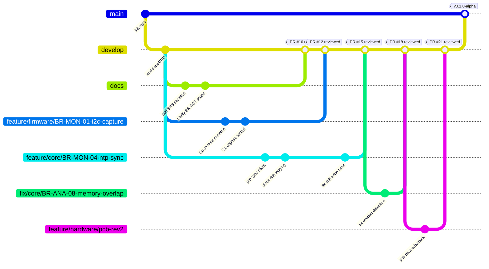
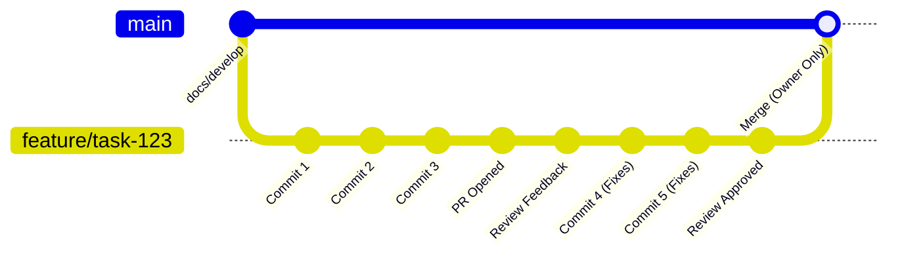
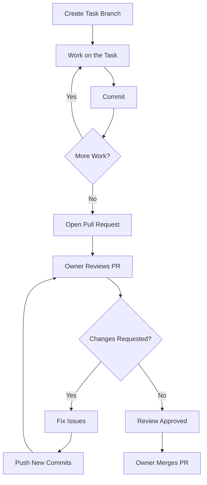

# Wiresploit

A unified cross-layer analysis platform that correlates every communication—from network packets to hardware buses—into a single, searchable and analysable timeline, revealing the complete behavior of embedded and IoT devices.


<div class="grid cards" markdown>


-   [](https://discord.gg/PNt62532N)

-   [](https://app.clickup.com/9015638084/v/o/s/901511461217)

-   [](./Resources.md)

-   [](https://github.com/EG-ETCS/Wiresploit)

</div>


## 1. project documents

### 1.1 Project Management Documents

| Document Name                                                                 | Description                                                         | Owner        | Date      | Status   |
|------------------------------------------------------------------------------|---------------------------------------------------------------------|--------------|------------|----------|
| [Project Charter](00_Project_Management/01_Charter.md)                      | Defines project purpose, objectives, scope, and key stakeholders    | CERT-team    | 14-7-2026   | 🟢 Final |
| [Project Plan](00_Project_Management/02_Plan.md)                             | Outlines the detailed project management and approach               |            |          |  |
| [Project Schedule](00_Project_Management/03_Schedule.md)                     | Timeline, milestones, and deliverables schedule                     |            |          |  |
| [Issue Log](00_Project_Management/04_Issue_Log.md)                           | Records project issues and their resolution status                  |            |          |  |


### 1.2 Requirements

| Document Name                                                                 | Description                                                         | Owner                  | Date       | Status   |
|------------------------------------------------------------------------------|---------------------------------------------------------------------|------------------------|------------|----------|
| [Business Requirements Document (BRD)](01_Requirements/00_BRD.md)            | Details business case, objectives, and high-level requirements      | CERT-team    | 14-7-2026  | 🟢 Final |
| [System Requirements Specification (SysRS)](01_Requirements/01_SysRS/01_Functional_Requirements.md) | Top-level system requirements for the solution                     |    |  |  |
| [Software Requirements Specification (SwRS)](01_Requirements/02_SwRS.md)      | Software-specific detailed requirements                            |    |  |  |
| [Hardware Requirements Specification (HwRS)](01_Requirements/03_HwRS.md)      | Hardware-specific detailed requirements                            |    |  |  |
| [Firmware Requirements Specification (FwRS)](01_Requirements/04_FwRS.md)      | Firmware-specific detailed requirements                            |    |  |  |
| [Acceptance Criteria](01_Requirements/05_Acceptance_Criteria.md)              | Success criteria for evaluating requirements fulfillment           |    |  |  |

### 1.3 System Architecture

| Document Name                                                                 | Description                                                         | Owner                  | Date       |Status   |
|------------------------------------------------------------------------------|---------------------------------------------------------------------|------------------------|------------|---------|
|                                                                              |                                                                     |                        |            |  |

### 1.4 Documentation

| Document Name                                                                 | Description                                                         | Owner                  | Date       |Status   |
|------------------------------------------------------------------------------|---------------------------------------------------------------------|------------------------|------------|---------|
| [User Manual](03_Documentation/00_User_Manual.md)         | End-user documentation and usage guide                          |    |  | |
| [API Documentation](03_Documentation/01_API_Documentation.md)     | Technical reference for platform APIs                   |    |  | |
| [Installation Guide](03_Documentation/02_Installation_Guide.md)   | Setup & installation instructions for all components    |    |  | |


## 2. Task Management Process

The project leverages [ClickUp](https://app.clickup.com/9015638084/v/o/s/901511461217) as the central platform for managing, tracking, and reviewing all project tasks and deliverables.

### 2.1 Task Lifecycle and States

<div class="grid" markdown>

=== "Task States"
    Tasks flow through distinct stages as visualized in the following chart:

    | Task State   | Description                                                                                                                     |
    |--------------|---------------------------------------------------------------------------------------------------------------------------------|
    | **Backlog**  | All new and pending tasks are added to the backlog, where they await prioritisation and selection.                              |
    | **To Do**    | Tasks selected for the upcoming sprint or iteration are moved here.                                                             |
    | **In Progress** | When a team member (from the Helwan team) begins working on a task, it transitions to "In Progress".                        |
    | **Blocked**  | If a task is impeded by external factors (e.g., dependencies, missing hardware), it's flagged as Blocked for visibility.        |
    | **Completed**| Once finished, tasks move to Completed, pending further review.                                                                 |
    | **In Review**| CERT team reviews the deliverable for quality and completeness.                                                                 |
    | **Rejected** | If the deliverable does not meet acceptance criteria, the CERT team can reject it, requiring further rework.                    |
    | **Closed**   | After CERT approval, the task is marked as Closed, indicating official completion.                                              |

```mermaid
flowchart TD
    BL(BACKLOG):::BACKLOG -- sprint's Tasks --> TODO(TO DO):::TODO
    subgraph Helwan team
        TODO -- task picked up --> INPROGRESS(IN PROGRESS):::INPROGRESS
        INPROGRESS -- waiting on another task or missing hardware --> BLOCKED(BLOCKED):::BLOCKED
        INPROGRESS -- task completed by team member --> COMPLETED(COMPLETED):::COMPLETED
    end
    subgraph CERT team
        COMPLETED -- Task selected by CERT team for formal review --> REVIEW[IN REVIEW]:::REVIEW
        REVIEW -- CERT team reviewed and rejected the task --> REJECTED(REJECTED):::REJECTED
        REVIEW -- CERT team formally approves the deliverable --> CLOSED(CLOSED):::CLOSED
    end
    
    %% Node colors
    classDef BACKLOG fill:#8D8D8D,stroke:#444444,stroke-width:2px,font-weight:bold;
    classDef TODO fill:#5C47CD,stroke:#3B2580,stroke-width:2px,font-weight:bold;
    classDef INPROGRESS fill:#FFC53D,stroke:#B98A1C,stroke-width:2px,color:#000000,font-weight:bold;
    classDef BLOCKED fill:#000000,stroke:#191919,stroke-width:2px,font-weight:bold;
    classDef COMPLETED fill:#12A594,stroke:#07584E,stroke-width:2px,font-weight:bold;
    classDef REVIEW fill:#C36522,stroke:#7A4004,stroke-width:2px,font-weight:bold;
    classDef REJECTED fill:#E5484D,stroke:#831921,stroke-width:2px,font-weight:bold;
    classDef CLOSED fill:#2C8C5E,stroke:#1F4135,stroke-width:2px,font-weight:bold;
```





</div>


### 2.2 Responsibilities & Process

- **Task Creation:**{._red} Tasks can be created by any stakeholder, with details such as description, assignee, due date, and priority.
- **Assignment:** Tasks are assigned to appropriate team members via ClickUp, clarifying ownership.
- **Regular Updates:**{._red} Team members update task status as progress is made, ensuring real-time visibility for all stakeholders.
- **Review & Approval:**{._red} The CERT team is responsible for formal reviews, acceptance, or rejection of completed deliveries.
- **Traceability:**{._red} All changes, comments, attachments, and status updates are logged in the project's Github repo for a comprehensive project audit.


## 3. GitHub Branches, Workflow, and Rules


### 3.1 Branches

This section defines the standard naming convention for Git branches in the **Wiresploit** repository. It makes clear at a glance which part of the project (core, firmware, hardware, or docs) a branch touches, and links code changes directly back to Business Requirements (BR-IDs) for traceability in reports and audits.




### 3.2 Branching Strategy

- **main branch:**{._red} Always stable, production-ready code. Only CERT-approved and reviewed changes are merged here.
- **develop branch:**{._red} Integration branch containing the latest delivered features, bugfixes, and changes. Most feature branches are merged here after review.
- **docs branch**{._red} For documentation, requirements, or architecture work.
- **Feature branches:**{._red} Short-lived branches created from `develop` for each new feature, enhancement, or fix. Convention: `feature/<component>/<short-description-or-BR-ID>`.
- **fix branches:**{._red} For urgent fixes applied to production (`main`). Convention: `fix/<component>/<BR-ID>-<short-description>`.

!!! note "Branch Naming Convention"
    
    Used with `feature/` and `fix/` branches:

    - `core`
    - `firmware`
    - `hardware`

    rules 

    - All **lowercase**
    - Words separated by `-` (not spaces or `_`)
    - Sections separated by `/`
    - BR-ID (if applicable) written exactly as in the BRD: `BR-MON-04`, not `br-mon-04` or `BRMON04`
    - Keep the whole name under ~50 characters where possible


    for Example:

    ```
    feature/core/BR-MON-04-ntp-sync
    feature/firmware/BR-MON-01-i2c-capture
    feature/hardware/BR-ACT-03-pcb-rev2
    fix/core/BR-ANA-08-memory-overlap
    ```


### 3.3 GitHub Workflow

1. **Create a Branch:**{._red} For each task, create a branch from `develop` using the feature/fix naming conventions.
2. **Commit Changes:**{._red} Make descriptive, atomic commits (referencing ClickUp or task IDs where possible).
3. **Push & PR:**{._red} Push the branch and open a Pull Request (PR) targeting `develop` (or `main` for fixes). Ensure PR description references the related task or issue.
4. **Code Review:**{._red} At least one reviewer (peer review) must review the PR.
5. **CERT Review:**{._red} CERT team reviews and approves PRs, especially for critical or production changes.
6. **Merge:**{._red} Only after all required approvals pass, PRs are merged to the main.
7. **Delete branch:**{._red} After merging, delete the feature/fix branch.




### 3.4 Rules

- **No direct pushes to `main` or `develop`.** All changes enter via PRs.
- **PR descriptions must include:**
  - Summary of changes
  - Related ClickUp/GitHub task/issues
  - Screenshots/test results (where applicable)
- **Reviewers:** Assign at least one reviewer (CERT team for critical paths, peer review otherwise).
- **Documentation:** Update relevant documentation with code changes.
- **Protected branches:** `main` (and often `develop`) should be protected in repository settings to require PRs, passing checks, and approvals.




!!! bug "important note" 
    All work should be done through Pull Requests (PRs), never by directly committing to `main` or `develop` or `docs`.


## 4. Coding Standards & Commenting Guidelines

This section defines the coding rules, style conventions, and commenting standards to be followed across all components of Wiresploit. The goal is to keep the codebase consistent, readable, secure, and maintainable across the core (backend + UI) and Capture Node firmware, regardless of which engineer is writing the code per BO-06.


!!! info

    BO-06: Build a reusable, extensible internal tool/platform rather than a one-off script, so it can grow with future assessment needs


### 4.1 General Principles (All Languages)

1. **Clarity over cleverness.**{._red} Code is read far more often than it is written. Prefer the obvious solution over a "smart" one-liner code.
2. **Single Responsibility.**{._red} Each function/class/module should do single task. If you need to perform multiple tasks, split it into two functions.
3. **No magic numbers/strings.**{._red} Use named constants or enums (e.g., `MAX_CAPTURE_NODES`, not `16`).
4. **Fail loudly, fail safely.**{._red} Never silently swallow errors. a hidden failure means lost evidence — log it, surface it, and handle it explicitly.
5. **Consistent formatting.**{._red} Use an auto-formatter per language (see §5) and run it before every commit. Formatting is not a matter of personal taste in this project.
6. **No commented-out code in commits.**{._red} Delete commented-out code sections before committing code to github,  version control (Git) already remembers it.
7. **Deterministic time handling.** All timestamps must use a single, explicit time source/format (per BR-MON-04). Never mix local time and UTC in the same module.


### 4.2 Naming Conventions

| Element | Python | C/C++ (Firmware) | Web-based (JS/TS) |
|---|---|---|---|
| Variables / functions | `snake_case` — `capture_node_id`, `def get_session_timeline():` | `snake_case` — `capture_node_id`, `read_i2c_frame()` | `camelCase` — `captureNodeId`, `getSessionTimeline()` |
| Classes / Types | `PascalCase` — `CommunicationBlock`, `SnapshotBlock` | `PascalCase` — `typedef struct GpioEvent`, `typedef struct SnapshotBlock` | `PascalCase` — `CommunicationBlock`, `SnapshotBlock` |
| Constants | `UPPER_SNAKE_CASE` — `DEFAULT_SYNC_INTERVAL_MS` | `UPPER_SNAKE_CASE` (macros) — `#define MAX_FRAME_LEN` | `UPPER_SNAKE_CASE` — `DEFAULT_SYNC_INTERVAL_MS` |
| Files/modules | `snake_case.py` — `bus_correlator.py` | `snake_case.c` / `.h` — `i2c_capture.c`, `gpio_driver.h` | `kebab-case.tsx` — `timeline-view.tsx` |
| Booleans | Prefix `is_`/`has_`/`should_` — `is_synced`, `has_secret_flag` | Prefix `is_`/`has_`/`should_` — `is_synced`, `has_secret_flag` | Prefix `is`/`has`/`should` — `isSynced`, `hasSecretFlag` |


Domain terms from the BRD/Charter must be used consistently and match the documents exactly:

- **Core** (not "server" or "backend" alone)
- **Capture Node** (not "sniffer" or "probe")
- **Communication Block (CB)** / **Snapshot Block (SB)**
- **Device Under Test (DUT)**


### 4.3 Commenting Standards

- Comments explain **why the class/function/line is doing that**{._red}, not **what the class/function/line is doing**{._red}. The code already shows *what* it does; a comment should add context a reader can't get from the code itself (rationale, trade-offs, links to requirement IDs).

<div class="grid" markdown>

```python
# bad comment

# increment the retry counter by 1
retry_count += 1

# loop through all capture nodes
for node in capture_nodes:
    # check if node is synced
    if node.is_synced:
        node.send_heartbeat()
```

```python
# good comment

# Retry up to MAX_RETRIES because Capture Nodes on wireless links
# occasionally miss the first heartbeat after a Wi-Fi channel hop.
retry_count += 1

for node in capture_nodes:
    # Skip unsynced nodes — sending a heartbeat before PTP sync completes
    # can be misread by the node as a reset trigger (see BR-MON-04).
    if node.is_synced:
        node.send_heartbeat()
```
</div>

- All comments must accurately **reflect the current code**{._red}. If you modify code, ensure you update its associated comments in the **same commit**{._red}. Outdated or incorrect comments are more harmful than having no comments at all. When changing a comment due to code changes, **reference the previous comment**{._red} as necessary to clarify your rationale for future readers.

<div class="grid" markdown>

```python
# Retry up to 3 times before giving up
for attempt in range(5):
    result = send_heartbeat(node)
    if result.ok:
        break
```

```python
# Retry up to 5 times — increased from 3 after observing
# wireless nodes needing extra attempts post channel-hop.
for attempt in range(5):
    result = send_heartbeat(node)
    if result.ok:
        break
```
</div>

- **No commented-out/dead code**{._red} blocks, no TODO left without an owner or ticket reference (e.g., `# TODO(mohamed): handle SPI clock stretching`).

### 4.4 Required Documentation Comments

Every **public function, class, and module** must have a documentation comment (docstring / Doxygen block / JSDoc) covering:

- **Purpose**{._red} — one-line summary.
- **Params**{._red} — name, type, meaning, units (critical for anything timing/voltage/frequency related).
- **Returns**{._red} — type and meaning.
- **Raises/Errors**{._red} — expected error conditions.
- **Requirement traceability**{._red} (where applicable) — reference the BR ID it implements, e.g. `Implements: BR-MON-02`.

**Python example:**
```python
def correlate_events(network_events: list[Event], bus_events: list[Event]) -> list[CommunicationBlock]:
    """
    Merge network-layer and bus-layer events into causally ordered Communication Blocks.

    Uses the shared PTP-synced clock (BR-MON-04) to align events within the
    configured correlation window. Events outside the window are emitted as
    unmatched (see BR-ANA-08 style completeness reporting).

    Args:
        network_events: Timestamped events captured from the core's network tap.
        bus_events: Timestamped events reported by Capture Nodes (I2C/SPI/UART/GPIO).

    Returns:
        A time-ordered list of CommunicationBlock objects.

    Raises:
        ClockDriftError: If drift between sources exceeds the documented tolerance.

    Implements: BR-MON-02, BR-MON-04
    """
```

**C/C++ (firmware) example:**
```c
/**
 * @brief Reads a single I2C transaction frame from the capture buffer.
 *
 * @param buf     Pointer to the raw capture buffer.
 * @param len     Length of the buffer in bytes.
 * @param out     Destination for the parsed frame.
 * @return 0 on success, negative error code on malformed frame.
 *
 * @note Does not modify bus state; passive tap only (BR-ENV-01).
 */
int read_i2c_frame(const uint8_t *buf, size_t len, I2cFrame *out);
```

### 4.5 Inline Comments

- Use only **for non-obvious logic**{._red} (bit manipulation, protocol-specific cases, timing-sensitive sections).
- **Place above the line(s)**{._red} they explain, not trailing at the end of long lines.

### 4.6 File Headers

Every source file starts with a **short header**{._red} block:
```python
"""
Module: bus_correlator.py
Purpose: Correlates I2C/SPI/UART bus events with network events into CBs.
Owner: Software Team
"""
```

